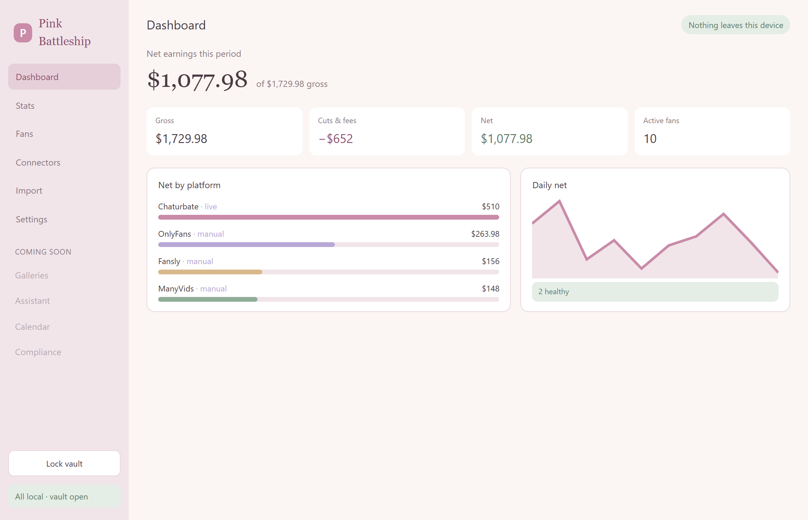
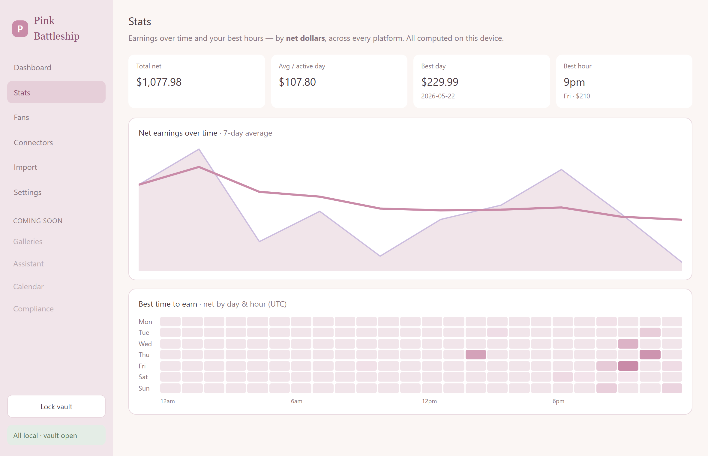

# Pink Battleship 🩷

A local-first desktop business cockpit for independent, multi-platform content creators.

Pink Battleship brings your platforms, earnings, fans, and content into one private app that runs on **your** machine. Credentials, finances, and content stay local by design — there is no telemetry and no cloud account.

> **Status:** active development. Windows & macOS desktop app (Electron).

## Download

Grab the installer for your system from the [latest release](https://github.com/sasha-thecornerspore-dev/pink-battleship/releases/latest): Windows 10/11 (installer or portable), macOS Apple Silicon, or macOS Intel. Installed copies keep themselves current, and **Settings → Updates** switches between *Automatic* and *On demand*.

## Highlights

- **Unified net P&L** across Chaturbate, OnlyFans, Fansly, ManyVids — gross → cuts → net, with configurable dated rate estimates.
- **Fan rolodex** — every spender ranked by net, with whale / VIP tiers, lapsed-fan win-back nudges, and private on-device notes.
- **Stats** — a net-earnings time-series with a 7-day moving average, and a day×hour "best time to earn" heatmap keyed on real dollars (not viewer guesses).
- **Connectors** — official APIs where they exist (Chaturbate), manual CSV import where they don't (no automation, no ban risk).
- **AI assistant** — captions, fan replies, content ideas. A free local model (Ollama) is the baseline; bring-your-own-key hosted providers (Claude/Gemini/Groq/Venice/…) actually generate, each with an editable model. A safety router hard-blocks prohibited content on every backend, keeps explicit work off SFW providers, and forces fan-PII on-device.
- **Galleries (DAM)** — import photos/videos *referenced in place* (originals never copied), with thumbnails, tags, NSFW safe-mode, and cross-platform posted-status.
- **Live (OBS)** — read your OBS stream status (live/scene/duration) over its local WebSocket; a Dashboard banner when you're on.
- **Website builder** — a self-contained link-in-bio page with an 18+ age gate, live preview, and HTML export.
- **Calendar & compliance** — plan posts/mass-DMs/go-lives; a 2257 records vault, custodian statement, tax set-aside, and DMCA generator.
- **Local-first & private** — encrypted SQLite vault (passphrase + OS keychain), a fail-closed network gateway, a "what leaves your machine" inspector, and a panic-lock.
- **Soft pastel UI** — three selectable themes × light/dark.




## Try the prototype (no install of the desktop app)

Click through the whole app in your browser — the real core logic, in-memory, no Electron:

```bash
npm install
npm run prototype
```

## Run the desktop app

```bash
npm install
npm run rebuild   # build the native encrypted-DB module against Electron's ABI
npm run dev
```

## Develop

```bash
npm test          # unit suite (Vitest)
npm run typecheck
npm run build     # production build (main + preload + renderer)
npm run test:e2e  # Playwright happy-path (needs a display)
```

## Docs

- [Getting started](docs/getting-started.md)
- [Architecture](docs/architecture.md)
- [Distribution & release pipeline](docs/distribution.md)
- [Paid galleries & checkout — design + threat model](docs/paid-galleries-design.md) *(design only, not yet built)*
- [Product blueprint](docs/Pink-Battleship-Blueprint.md)

## Tech

Electron · React · TypeScript · Tailwind · SQLite (SQLCipher) · Vitest · electron-builder. Distributed as signed Windows/macOS installers from GitHub Releases. Not affiliated with any third-party platform.

## License

Proprietary — Copyright © 2026 Corner Spore. All rights reserved. See [LICENSE](LICENSE).
